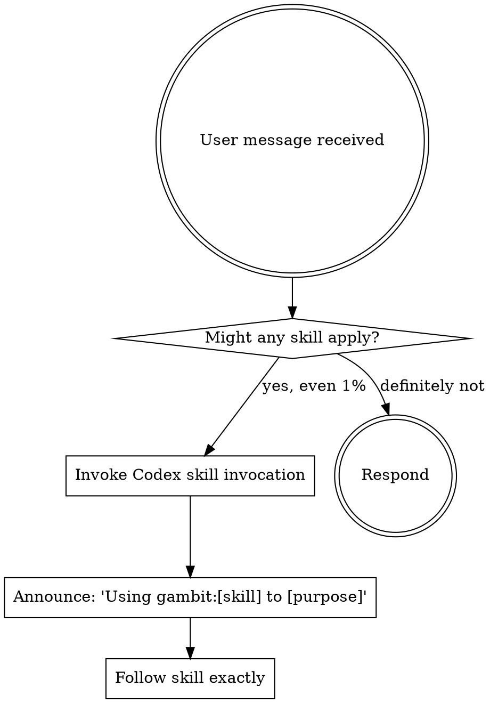

<!-- Generated backend adapter: edit src/backends/codex/, not plugins/gambit/. -->

## Codex Backend

This skill is assembled for Codex. Before following the workflow, read
`references/codex-backend.md` completely. Its operation mappings are binding;
names such as `GambitTaskList` and `SpawnAgent` are backend operations, not
literal shell commands.

<EXTREMELY-IMPORTANT>
If you think there is even a 1% chance a skill might apply to what you are doing, you ABSOLUTELY MUST invoke the skill using Codex skill invocation.

IF A SKILL APPLIES TO YOUR TASK, YOU DO NOT HAVE A CHOICE. YOU MUST USE IT.

This is not negotiable. This is not optional. You cannot rationalize your way out of this.
</EXTREMELY-IMPORTANT>

# Using Gambit

Gambit provides structured development workflows using Gambit's durable Codex task store. This skill is the entry point for routing work to the correct skill.

**Invoke relevant skills BEFORE any response or action.** Even a 1% chance a skill might apply means you invoke the skill to check. If it turns out to be wrong, you don't need to follow it.

## Rigidity Level

LOW FREEDOM — Always check for relevant skills before acting. Never skip the check. No exceptions.

## Instruction Priority

Gambit skills override default system prompt behavior where they conflict, but **user instructions always take precedence**:

1. **User's explicit instructions** (AGENTS.md at any scope, direct requests in the current conversation) — highest priority
2. **Gambit skills** — override default system behavior where they conflict
3. **Default system prompt** — lowest priority

If a user AGENTS.md says "don't use TDD for this project" and `gambit:test-driven-development` says "always use TDD," follow the user. The user is in control.

This does NOT mean a terse user instruction ("add X", "fix Y") exempts you from checking for skills first — see the User Instructions section below. It means that when a user has *explicitly* opted out of a workflow, their instruction wins.

## How to Access Skills

Use the Codex skill invocation. When you invoke a skill, its content is loaded — follow it directly. Never use the Codex file-reading capability on skill files.

## Quick Reference

| Task Type | Skill | Slash Command |
|-----------|-------|---------------|
| New feature idea | brainstorming | `$gambit:brainstorming` |
| Execute tasks | executing-plans | `$gambit:executing-plans` |
| Fix a bug | debugging | `$gambit:debugging` |
| Implement with TDD | test-driven-development | `$gambit:test-driven-development` |
| Improve code structure | refactoring | `$gambit:refactoring` |
| Review implementation | review | `$gambit:review` |
| Audit test quality | testing-quality | `$gambit:testing-quality` |
| Refine task details | task-refinement | `$gambit:task-refinement` |
| Verify completion | verification | `$gambit:verification` |
| Parallel investigations | parallel-agents | `$gambit:parallel-agents` |
| Create/modify skills | writing-skills | `$gambit:writing-skills` |
| Finish feature branch | finishing-branch | `$gambit:finishing-branch` |

## The Rule



## Skill Selection Guide

**User describes a new idea or feature, no epic yet → gambit:brainstorming**

```
gambit:brainstorming
   Creates epic (immutable requirements) + first wave of pluckable tasks via Socratic questioning,
   scaled to how clear the idea already is — a crisp spec gets brief questioning,
   a rough idea gets more. Tasks are created iteratively during execution, never
   all upfront. Brainstorming asks (in prose): refine tasks first? → routes to
   executing-plans, which enters the epic worktree automatically.
```

**If an epic and tasks already exist → gambit:executing-plans directly.**

**There is no separate plan-writing skill.** "Break this into tasks", "make an implementation plan", "lay out the tasks and dependencies" all route to `gambit:brainstorming` (which creates the epic + first wave of pluckable tasks; the rest are created iteratively during execution). Do NOT look for or invoke `gambit:writing-plans` — it does not exist. Upfront full task graphs are deliberately not part of gambit.

**The flow then continues automatically:**
```
executing-plans (one wave → checkpoint → STOP → repeat)
    ↓ all tasks done
review (4-reviewer parallel code review)
    ↓ approved
finishing-branch (verify → merge/PR/keep/discard)
```

**Skill Priority — when multiple skills could apply:**

1. **Process skills first** (brainstorming, debugging) — these determine HOW to approach the task
2. **Implementation skills second** (TDD, refactoring) — these guide execution
3. **Verification skills last** (verification, testing-quality) — these confirm results

"Let's build X" → brainstorming first, then TDD.
"Fix this bug" → debugging first to find the root cause, then brainstorming designs the fix.
"I think it's done" → verification before claiming complete.

## Red Flags

These thoughts mean STOP — you're rationalizing:

| Thought | Reality |
|---------|---------|
| "This is just a simple question" | Questions are tasks. Check for skills. |
| "I need more context first" | Skill check comes BEFORE clarifying questions. |
| "Let me explore the codebase first" | Skills tell you HOW to explore. Check first. |
| "This doesn't need a formal skill" | If a skill exists for it, use it. No exceptions. |
| "I remember this skill" | Skills evolve. Invoke the current version. |
| "This doesn't count as a task" | Action = task. Check for skills. |
| "The skill is overkill for this" | Simple things become complex. Use it. |
| "I'll just do this one thing first" | Check BEFORE doing anything. |
| "This is almost done, no need" | If you haven't verified, you're not done. |
| "Too simple for Tasks" | Simple tasks finish fast. Track them anyway. |
| "I know the pattern already" | Load the skill. Memory drifts, skills don't. |
| "Let me just fix this quickly" | Create a Task, follow the process. |
| "This feels productive" | Undisciplined action wastes time. Skills prevent this. |
| "I'll just spawn a quick default agent" | Use a contracted class from `codex-contracts/README.md`. A contractless agent has no blast-radius limit or return protocol. |

## Core Principles

These apply across ALL gambit skills:

1. **One wave then stop** — execute one wave (one task, or several independent tasks in parallel), checkpoint, STOP; a goal Stop-hook resumes without a human
2. **Tasks are source of truth** — Use `GambitTaskCreate`, `GambitTaskUpdate`, `GambitTaskList`, `GambitTaskGet`. Never track work mentally
3. **Evidence over assertions** — Run verification commands and show output before claiming done
4. **Small steps that stay green** — Tests pass between every change
5. **Immutable requirements** — Epic requirements don't change; Tasks adapt to reality
6. **Dispatch contracted agents** — When you spawn a subagent, use a named class from `codex-contracts/README.md` (worker/scout/finder/verifier/test-runner) with its contract by path and an explicit role. Never a bare `default` agent without a contract.

## User Instructions

Instructions say WHAT, not HOW. "Add X" or "Fix Y" doesn't mean skip workflows. The user telling you to do something does NOT exempt you from checking for skills first.

## Integration

**Triggered by:** Native skill discovery or explicit invocation

**Calls:** All other gambit skills based on task context

**Task tools used:**
- `GambitTaskCreate` — Create tasks with subject, description, activeForm
- `GambitTaskUpdate` — Set status (in_progress/completed), add blockers via `addBlockedBy`
- `GambitTaskList` — Find ready tasks (status=pending, blockedBy=[])
- `GambitTaskGet` — Read full task details and success criteria
